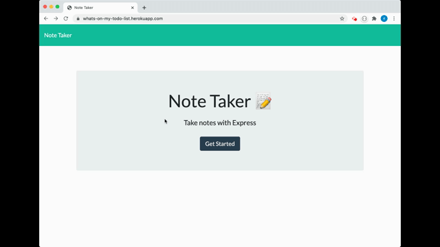

#  NOTE TAKER

For this assignment, we were instructed to create a working note taking application using express.js. The final product needs to allow the user to create & save notes, view previously saved notes, and delete previously saved notes. 

## USER STORY:  

```````````````````````
AS A user, I want to be able to write and save notes

I WANT to be able to delete notes I've written before

SO THAT I can organize my thoughts and keep track of tasks I need to complete
```````````````````````

## INSTALLATION:
No installations required to run the website. If downloading the repository, you will want to:
- Run "npm init" in the integrated terminal
- Run "npm i" for express, fs, path, & uuid  in the intergrated terminal to download dependencies.

## TECHNOLOGIES USED:  
- express.js

## LINKS:  
- https://github.com/eplatvoet/Note-Taker  
- https://eplatvoet.github.io/Note-Taker/  
- https://whats-on-my-todo-list.herokuapp.com/notes  

## SCREENSHOTS:  


